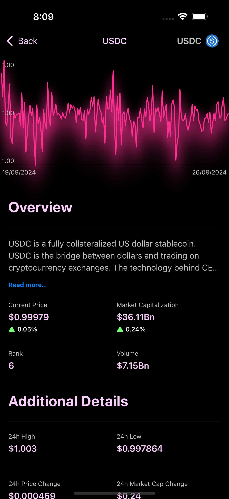

# CryptoTrackeriOSApp
An App made by following Swiftful Thinking course on Youtube, using CoinGecko API to fetch Coins price data using URLSessions and Combine and store them locally in the user's portfolio using CoreData

# Fetch Coins Prices from CoinGecko API

using URLSession and Combine to fetch the data from the API
 
 

# Filter the fetched Data using Combine Operators

 

# Local Portfolio for storing the coins data locally using CoreData

 

 
 

 
 

# Coin details screen with Charts for the price changes

 

 
 

# Info Settings screen for displaying information about the app and its Developer

 

## Technical Details:
 
* App Current Version: V1.0
* Supported iOS: iOS 15.0 or above (iPad is also supported)
* Third-party Libraries: None 
* Architecture: MVVM
* UI: SwiftUI
* Async: Combine
* Local Storage: CoreData - Image Caching using FileManager
* Networking: URLSession
* External APIs: CoinGecko API
* Supported languages in App: English

## Video Preview:

[][preview]

## Important Notes:
  
- I didn't include my CoinGecko API key, you need to get yours from the API dashboard

## Contact Me:

[][contact]  [][fb]  [][tw]  [][mail]

#### Check My Other Apps: 

[][youtube] [][mygithubrepos] 

 
 

<h2 align="center">🤝 Support</h2>

💙 If you like this project, Give it a ⭐ and Share it with friends! 💙

[website]: https://docs.coingecko.com/reference/introduction
[preview]: https://www.youtube.com/watch?v=JWe1PonAuBI&ab_channel=AbanoubAshraf

[contact]: https://www.linkedin.com/in/abanoub-ashraf-81b329b7/
[fb]: https://www.facebook.com/abanoub.ashraf.00/
[tw]: https://twitter.com/Abanoub_Ashraf_
[mail]: mailto:abanoub.ashraf10@gmail.com
[youtube]: https://www.youtube.com/channel/UCaH0SjSVk045E165fGh9wjg/videos
[mygithubrepos]: https://github.com/abanoub-ashraf?tab=repositories